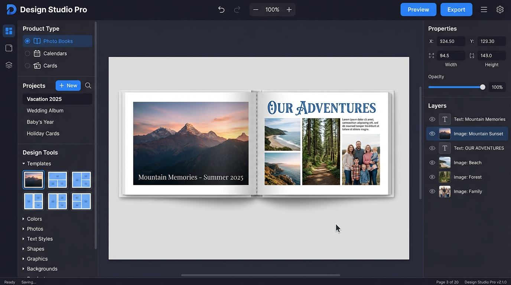

# UI/UX Specification

## Design Principles

### Core Principles
1. **Simplicity First**: Complex features shouldn't complicate basic tasks
2. **Direct Manipulation**: See immediate results of actions
3. **Progressive Disclosure**: Advanced features available when needed
4. **Consistent Patterns**: Similar actions work the same way everywhere
5. **Performance Perception**: UI remains responsive during operations

## Application Layout

### Visual Reference



### Main Window Structure

The layout follows a "Sidebar-First Navigator" pattern: a minimal single-row header maximizes canvas space, while a unified left sidebar provides product type selection, project management, and design tools in a single scrollable panel.

```
┌──────────────────────────────────────────────────────────────────────┐
│ Header: [Logo]  [Undo][Redo] [Zoom −][100%][+]  [Preview][Export][☰][⚙] │
├──────────────────────────────────────────────────────────────────────┤
│ ┌─────────────────┬──────────────────────────────┬──────────────┐   │
│ │ Left Sidebar    │                              │ Right Panel  │   │
│ │ (~280px)        │                              │ (~240px)     │   │
│ │                 │                              │              │   │
│ │ ┌─────────────┐ │                              │ Properties   │   │
│ │ │Product Type │ │        Canvas Area           │ Inspector    │   │
│ │ │● Photo Books│ │                              │              │   │
│ │ │○ Calendars  │ │     (Design Workspace)       │──────────────│   │
│ │ │○ Cards      │ │                              │              │   │
│ │ │○ Photo Sheets│                               │              │   │
│ │ ├─────────────┤ │                              │ Layers       │   │
│ │ │Projects     │ │                              │ Panel        │   │
│ │ │[+New][🔍]   │ │                              │              │   │
│ │ │▸ Project 1  │ │                              │              │   │
│ │ │  Project 2  │ │                              │              │   │
│ │ ├─────────────┤ │                              │              │   │
│ │ │Design Tools │ │                              │              │   │
│ │ │▾ Templates  │ │                              │              │   │
│ │ │  [grid]     │ │                              │              │   │
│ │ │▸ Colors     │ │                              │              │   │
│ │ │▸ Photos     │ │                              │              │   │
│ │ │▸ Text Styles│ │                              │              │   │
│ │ │▸ Shapes     │ │                              │              │   │
│ │ │▸ Graphics   │ │                              │              │   │
│ │ │▸ Backgrounds│ │                              │              │   │
│ │ └─────────────┘ │                              │              │   │
│ └─────────────────┴──────────────────────────────┴──────────────┘   │
│ Status Bar  [Ready] [Saving...] [Page 3 of 20] [Design Studio Pro]  │
└──────────────────────────────────────────────────────────────────────┘
```

### Responsive Breakpoints

```typescript
interface Breakpoints {
  minimum: { width: 1280, height: 720 };   // Minimum supported
  compact: { width: 1440, height: 900 };   // Laptop
  standard: { width: 1920, height: 1080 }; // Desktop
  large: { width: 2560, height: 1440 };    // Large display
}
```

## Component Specifications

### Header Bar

A single-row header (~44px) that keeps the interface compact and maximizes canvas space.

```
┌──────────────────────────────────────────────────────────────────────┐
│  🎨 Design Studio Pro  [Undo][Redo] [Zoom −][100%][+] [Preview][Export] [☰] [⚙] │
└──────────────────────────────────────────────────────────────────────┘
```

#### Layout

| Zone | Position | Contents |
|------|----------|----------|
| Logo | Far left | App logo + name "Design Studio Pro" |
| Primary actions | Center-left | Undo, Redo icons |
| Zoom controls | Center | Zoom out (−), percentage display, Zoom in (+) |
| Secondary actions | Center-right | Preview button, Export button |
| Menu & settings | Far right | Hamburger menu (☰), Settings gear (⚙) |

#### Hamburger Menu (☰)

The full traditional menu is accessible via the hamburger icon:

```
File
├── New Project...          Ctrl+N
├── Open...                 Ctrl+O
├── Open Recent            →
├── ──────────────
├── Save                    Ctrl+S
├── Save As...              Ctrl+Shift+S
├── Export                 →
│   ├── PDF for Print...
│   ├── Images...
│   └── Project Package...
└── Exit                    Ctrl+Q

Edit
├── Undo                    Ctrl+Z
├── Redo                    Ctrl+Shift+Z
├── ──────────────
├── Cut                     Ctrl+X
├── Copy                    Ctrl+C
├── Paste                   Ctrl+V
├── ──────────────
├── Select All              Ctrl+A
└── Preferences...          Ctrl+,
```

### Left Sidebar

A unified, scrollable panel (~280px wide) divided into three zones separated by horizontal dividers. All three zones are always visible; the Design Tools zone only becomes interactive when a project is open.

```typescript
interface LeftSidebar {
  width: 280;
  minWidth: 240;
  maxWidth: 360;
  resizable: true;
  collapsible: true;
  zones: ["productType", "projects", "designTools"];
}
```

#### Zone 1: Product Type Selector

Radio-style selector with icons. Changing the product type filters the project list and available templates below.

```typescript
interface ProductTypeSelector {
  options: [
    { id: "photo_book", label: "Photo Books", icon: "book" },
    { id: "calendar", label: "Calendars", icon: "calendar" },
    { id: "card", label: "Cards", icon: "card" },
    { id: "photo_sheet", label: "Photo Sheets", icon: "image" }
  ];
  behavior: {
    selectionStyle: "radio";
    highlightColor: "primary.500";
    persistSelection: true;
  };
}
```

```
┌──────────────────────┐
│  Product Type        │
│ ┌──────────────────┐ │
│ │ 📖 Photo Books   ● │ │
│ │ 📅 Calendars     ○ │ │
│ │ 🃏 Cards         ○ │ │
│ │ 🖼 Photo Sheets  ○ │ │
│ └──────────────────┘ │
│━━━━━━━━━━━━━━━━━━━━━━│
```

#### Zone 2: Projects

Project list filtered by the selected product type. Shows a "+ New" button and search. Active project is highlighted in bold.

```typescript
interface ProjectsZone {
  actions: ["create", "search"];
  display: {
    style: "compact-list";
    showThumbnail: false;
    showMetadata: true;
    activeHighlight: "bold + accent-border";
  };
  sorting: "last-modified";
  contextMenu: ["rename", "duplicate", "archive", "delete"];
}
```

```
│  Projects            │
│  [+ New] [🔍 Search] │
│ ┌──────────────────┐ │
│ │ ▸ Vacation 2025  │ │  ← active project (bold)
│ │   Wedding Album  │ │
│ │   Baby's Year    │ │
│ │   Holiday Cards  │ │
│ └──────────────────┘ │
│━━━━━━━━━━━━━━━━━━━━━━│
```

#### Zone 3: Design Tools

Accordion-style collapsible sections. Only one section is expanded at a time. Each section provides drag-to-canvas functionality.

```typescript
interface DesignToolsZone {
  sections: [
    {
      id: "templates",
      label: "Templates",
      icon: "grid",
      content: "thumbnail-grid",
      filterable: true,
      searchable: true,
      categories: ["wedding", "travel", "baby", "modern", "minimal", "classic"]
    },
    {
      id: "colors",
      label: "Colors",
      icon: "palette",
      content: "swatches-and-picker",
      subsections: ["color-schemes", "document-colors", "palettes", "custom-picker"]
    },
    {
      id: "photos",
      label: "Photos",
      icon: "image",
      content: "thumbnail-grid",
      source: "asset-library",
      dragToCanvas: true
    },
    {
      id: "text_styles",
      label: "Text Styles",
      icon: "type",
      content: "style-list",
      dragToCanvas: true
    },
    {
      id: "shapes",
      label: "Shapes",
      icon: "hexagon",
      content: "icon-grid",
      dragToCanvas: true
    },
    {
      id: "graphics",
      label: "Graphics",
      icon: "sparkle",
      content: "thumbnail-grid",
      searchable: true,
      dragToCanvas: true
    },
    {
      id: "frames",
      label: "Frames",
      icon: "frame",
      content: "thumbnail-grid",
      categories: ["simple", "decorative", "custom"],
      dragToCanvas: false,
      applyToSelection: true
    },
    {
      id: "backgrounds",
      label: "Backgrounds",
      icon: "layers",
      content: "thumbnail-grid",
      categories: ["solid", "gradient", "pattern", "image"]
    }
  ];

  behavior: {
    accordion: true;
    singleExpand: true;
    rememberLastOpen: true;
    disabledWhenNoProject: true;
  };
}
```

##### Templates Section (expanded)

```
│  Design Tools        │
│                      │
│  📐 Templates  ▾     │
│  [Search... 🔍]      │
│  Filter: [All ▾]     │
│  ┌────┬────┬────┐    │
│  │ t1 │ t2 │ t3 │    │
│  ├────┼────┼────┤    │
│  │ t4 │ t5 │ t6 │    │
│  └────┴────┴────┘    │
│                      │
│  🎨 Colors  ▸        │
│  🖼 Photos  ▸        │
│  ✏️ Text Styles ▸     │
│  ⬡ Shapes  ▸         │
│  🌸 Graphics ▸       │
│  🖽 Backgrounds ▸     │
└──────────────────────┘
```

##### Colors Section (expanded)

```
│  🎨 Colors  ▾        │
│                      │
│  Color Schemes       │
│  Filter: [All ▾]     │
│  ┌──────────────────┐│
│  │ Spring Pastels   ││
│  │ ██ ██ ██ ██ ██   ││  ← swatch strip preview
│  │        [Apply]   ││
│  ├──────────────────┤│
│  │ Autumn Warmth    ││
│  │ ██ ██ ██ ██ ██   ││
│  │        [Apply]   ││
│  ├──────────────────┤│
│  │ Modern Mono      ││
│  │ ██ ██ ██ ██ ██   ││
│  │        [Apply]   ││
│  └──────────────────┘│
│  [+ Save Current]    │
│                      │
│  Document Colors     │
│  ┌──┬──┬──┬──┬──┐   │
│  │  │  │  │  │  │   │  ← swatches from current project
│  └──┴──┴──┴──┴──┘   │
│                      │
│  Palettes  [+ New]   │
│  Warm Sunset      ▸  │
│  Ocean Breeze     ▸  │
│  Monochrome       ▸  │
│                      │
│  [🎯 Custom Color]   │
│  ┌───────────────┐   │
│  │ color picker   │   │
│  └───────────────┘   │
│  #3B82F6             │
└──────────────────────┘
```

##### Color Scheme Browser (modal, opened via "Browse All" link in Color Schemes)

```
┌─────────────────────────────────────────┐
│  Color Schemes                    [✕]   │
│                                         │
│  [Search... 🔍]                         │
│  Filter: [All Types ▾] [All Categories ▾]│
│                                         │
│  Seasonal                               │
│  ┌─────────┬─────────┬─────────┐        │
│  │ Spring  │ Summer  │ Autumn  │        │
│  │ Pastels │ Brights │ Warmth  │        │
│  │ ██████  │ ██████  │ ██████  │        │
│  └─────────┴─────────┴─────────┘        │
│                                         │
│  Occasion                               │
│  ┌─────────┬─────────┬─────────┐        │
│  │ Wedding │ Baby    │ Birthday│        │
│  │ Elegance│ Soft    │ Fun     │        │
│  │ ██████  │ ██████  │ ██████  │        │
│  └─────────┴─────────┴─────────┘        │
│                                         │
│  Apply to: (●) All pages  ○ Selected    │
│                                         │
│  [Cancel]              [Apply Scheme]   │
└─────────────────────────────────────────┘
```

### Canvas Area

#### Workspace Features

```typescript
interface CanvasWorkspace {
  view: {
    zoom: ZoomControls;
    rulers: boolean;
    guides: boolean;
    grid: GridSettings;
    bleeds: boolean;
  };
  
  interaction: {
    panMode: "spacebar" | "middleClick";
    selectMode: "click" | "marquee";
    multiSelect: "shift" | "ctrl";
    duplicateMode: "alt+drag";
  };
  
  feedback: {
    smartGuides: boolean;
    snapIndicators: boolean;
    measurements: boolean;
    tooltips: boolean;
  };
}
```

#### Page Navigation

Bottom of canvas:
```
[◀◀] [◀] [Page 1-2] [▶] [▶▶] [+Add Page]
```

### Right Panel

#### Properties Inspector

Context-sensitive property panels:

**No Selection**
- Document properties
- Page settings

**Image Selected**
- Position & Size
- Crop & Rotation
- Clipping Shape (Rectangle | Circle | Rounded Rectangle)
- Frame (None | select from frame presets)
- Adjustments
- Filters
- Effects

**Text Selected**
- Font family & size
- Color & alignment
- Spacing
- Effects

#### Layers Panel

```
Layers [👁] [🔒]
├─ Page 1
│  ├─ 🖼️ Background
│  ├─ 📷 Photo 1
│  ├─ 📷 Photo 2
│  └─ 📝 Title Text
└─ Page 2
   └─ ...
```

## Interaction Patterns

### Drag and Drop

#### Supported Operations
- Files from system → Canvas
- Assets from library → Canvas
- Objects between pages
- Reorder in layers panel
- Templates onto pages

#### Visual Feedback
```typescript
interface DragFeedback {
  cursor: "grab" | "grabbing" | "copy" | "move" | "not-allowed";
  preview: "ghost" | "outline" | "thumbnail";
  dropZone: {
    highlight: boolean;
    snapGuides: boolean;
    placeholder: boolean;
  };
}
```

### Selection Behavior

#### Selection Modes
1. **Single Click** - Select one object
2. **Shift+Click** - Add to selection
3. **Marquee** - Select multiple
4. **Double Click** - Enter edit mode

#### Selection Indicators
- Bounding box with handles
- Rotation handle above
- Corner radius controls (for shapes)
- Inline editing for text

### Context Menus

Right-click menus for objects:
```
┌─────────────────────┐
│ Cut                 │
│ Copy                │
│ Paste              │
│ ───────────────    │
│ Bring to Front     │
│ Send to Back       │
│ ───────────────    │
│ Group              │
│ Lock               │
│ Delete             │
└─────────────────────┘
```

## Modal Dialogs

### New Project Dialog

```
┌─────────────────────────────────────────┐
│ Create New Project                    × │
├─────────────────────────────────────────┤
│                                         │
│ Product Type:                           │
│ ┌─────┐ ┌─────┐ ┌─────┐               │
│ │Photo│ │     │ │     │ │Photo│        │
│ │Book │ │Cal. │ │Card │ │Sheet│        │
│ └─────┘ └─────┘ └─────┘ └─────┘        │
│                                         │
│ Size: [Dropdown: A4, Square, Custom v] │
│                                         │
│ Orientation: (•) Portrait ( ) Landscape │
│                                         │
│ Pages: [20    ] (min: 20, max: 200)   │
│                                         │
│ Template: [None                     v] │
│                                         │
│ [Cancel]              [Create Project] │
└─────────────────────────────────────────┘
```

### Export Dialog

```
┌─────────────────────────────────────────┐
│ Export for Print                      × │
├─────────────────────────────────────────┤
│ Format: [PDF/X-4                    v] │
│                                         │
│ ☑ Include Bleeds (3mm)                 │
│ ☑ Include Crop Marks                   │
│ ☐ Include Color Bars                   │
│                                         │
│ Color Profile: [FOGRA39             v] │
│                                         │
│ Quality: (•) High ○ Medium ○ Low       │
│                                         │
│ Pages: (•) All ○ Current ○ Range:___   │
│                                         │
│ ⚠️ 2 images below recommended resolution│
│ [View Issues]                          │
│                                         │
│ [Cancel]              [Export]         │
└─────────────────────────────────────────┘
```

## Visual Design System

### Color Palette

```typescript
const colors = {
  primary: {
    50: '#E3F2FD',
    100: '#BBDEFB',
    500: '#2196F3',  // Main
    700: '#1976D2',
    900: '#0D47A1'
  },
  
  neutral: {
    0: '#FFFFFF',
    100: '#F5F5F5',
    200: '#EEEEEE',
    300: '#E0E0E0',
    600: '#757575',
    900: '#212121'
  },
  
  semantic: {
    error: '#F44336',
    warning: '#FF9800',
    success: '#4CAF50',
    info: '#2196F3'
  }
};
```

### Typography

```typescript
const typography = {
  fonts: {
    ui: 'Inter, system-ui, sans-serif',
    mono: 'Fira Code, monospace'
  },
  
  sizes: {
    xs: '11px',
    sm: '13px',
    base: '14px',
    lg: '16px',
    xl: '20px'
  },
  
  weights: {
    normal: 400,
    medium: 500,
    semibold: 600,
    bold: 700
  }
};
```

### Spacing System

```typescript
const spacing = {
  unit: 4,  // Base unit in pixels
  xs: 4,    // 1 unit
  sm: 8,    // 2 units
  md: 16,   // 4 units
  lg: 24,   // 6 units
  xl: 32,   // 8 units
  xxl: 48   // 12 units
};
```

## Keyboard Shortcuts

### Essential Shortcuts

| Action | Windows/Linux | macOS |
|--------|--------------|-------|
| New | Ctrl+N | Cmd+N |
| Open | Ctrl+O | Cmd+O |
| Save | Ctrl+S | Cmd+S |
| Export | Ctrl+E | Cmd+E |
| Undo | Ctrl+Z | Cmd+Z |
| Redo | Ctrl+Shift+Z | Cmd+Shift+Z |
| Copy | Ctrl+C | Cmd+C |
| Paste | Ctrl+V | Cmd+V |
| Delete | Delete | Delete |
| Select All | Ctrl+A | Cmd+A |
| Zoom In | Ctrl++ | Cmd++ |
| Zoom Out | Ctrl+- | Cmd+- |
| Fit to Window | Ctrl+0 | Cmd+0 |

### Tool Shortcuts

| Tool | Key |
|------|-----|
| Selection | V |
| Text | T |
| Image | I |
| Shape | S |
| Zoom | Z |
| Pan | Space |

## Accessibility

### WCAG 2.1 Compliance

#### Level AA Requirements
- Color contrast ratio: 4.5:1 (normal text)
- Color contrast ratio: 3:1 (large text)
- Keyboard navigation for all features
- Screen reader support
- Focus indicators

#### Implementation
```typescript
interface AccessibilityFeatures {
  keyboard: {
    tabOrder: boolean;
    shortcuts: boolean;
    focusTrap: boolean;
  };
  
  screen: {
    ariaLabels: boolean;
    liveRegions: boolean;
    semanticHTML: boolean;
  };
  
  visual: {
    highContrast: boolean;
    reducedMotion: boolean;
    fontSize: "normal" | "large" | "extra-large";
  };
}
```

## Responsive Design

### Panel Behavior

```typescript
interface PanelResponsiveness {
  breakpoints: {
    collapse: 1440;  // Hide side panels
    stack: 1280;     // Stack panels vertically
    minimal: 1024;   // Show only canvas
  };
  
  behavior: {
    autoHide: boolean;
    floating: boolean;
    resizable: boolean;
    dockable: boolean;
  };
}
```

## Loading States

### Progressive Loading

```typescript
interface LoadingStates {
  skeleton: boolean;        // Show layout structure
  shimmer: boolean;        // Animated placeholders
  progress: boolean;       // Progress bars
  spinner: boolean;        // Loading spinners
  
  messages: {
    loading: "Loading project...",
    processing: "Processing images...",
    saving: "Saving changes...",
    exporting: "Generating PDF..."
  };
}
```

## Error Handling

### User-Friendly Error Messages

```typescript
interface ErrorUI {
  inline: {
    validation: "This field is required",
    format: "Invalid format",
    range: "Value out of range"
  };
  
  toast: {
    position: "bottom-right",
    duration: 5000,
    dismissible: true
  };
  
  modal: {
    critical: boolean,
    recovery: string[],
    support: string
  };
}
```

## Onboarding

### First-Time User Experience

1. **Welcome Screen**
   - Product selection
   - Template gallery
   - Recent projects

2. **Interactive Tutorial**
   - Highlight UI elements
   - Step-by-step guide
   - Skip option

3. **Contextual Help**
   - Tooltips on hover
   - Help icons
   - Video tutorials

## Performance Indicators

### Visual Feedback

```typescript
interface PerformanceUI {
  operations: {
    immediate: "< 100ms",   // No indicator
    fast: "100-300ms",     // Cursor change
    moderate: "300-1000ms", // Progress bar
    slow: "> 1000ms"       // Modal with progress
  };
  
  indicators: {
    cursor: CursorType;
    progressBar: boolean;
    percentage: boolean;
    timeRemaining: boolean;
    cancelButton: boolean;
  };
}
```